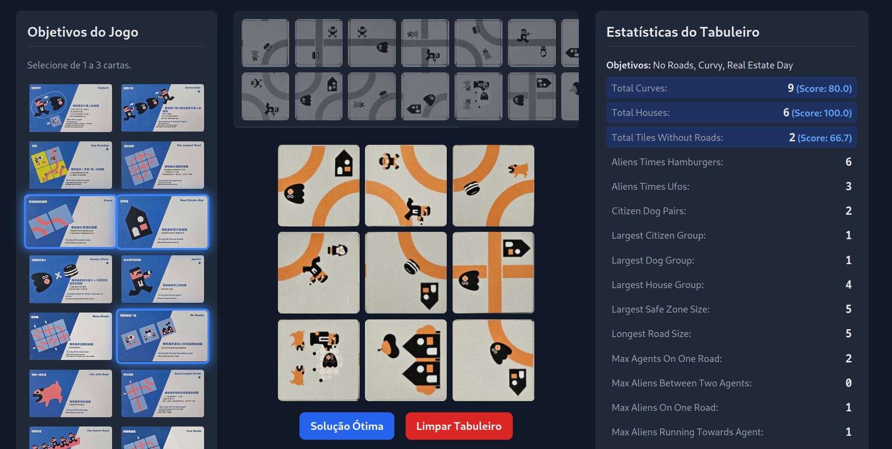
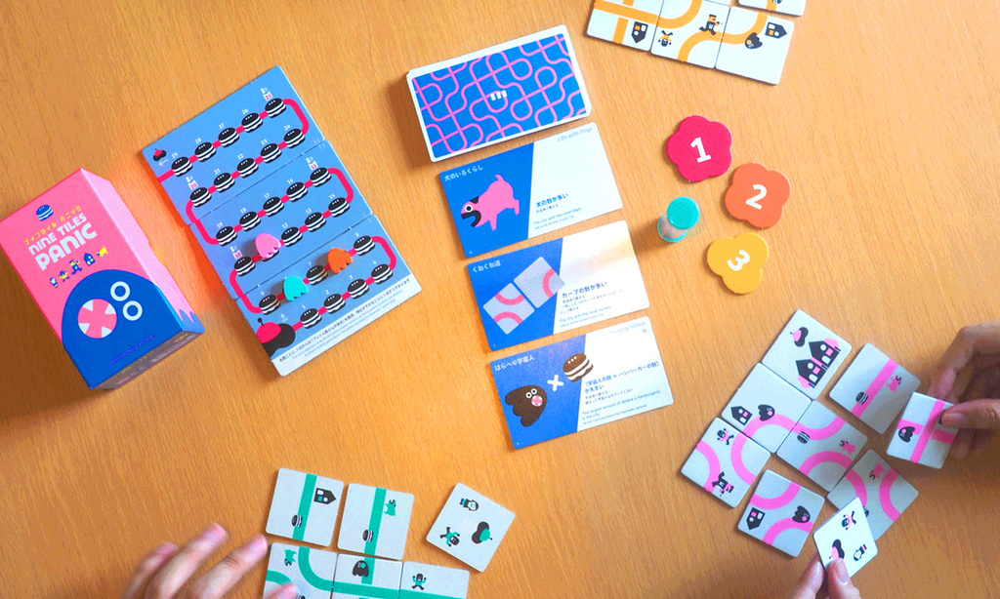

# Nine Tiles Panic Solver

This repository contains a comprehensive solver and analysis suite for the board game **Nine Tiles Panic**. The primary goal is to exhaustively generate every possible valid board configuration (~2.9 billion of them) and then perform a deep analysis to find the single "best" solution for any given combination of scoring cards.

👉 You can try the interactive solution visualizer deployed on **GitHub Pages** here: [Nine Tiles Panic Solver Interface](https://rolim520.github.io/Nine-Tiles-Panic-Solver/)



## Table of Contents


1.  [The Game: Nine Tiles Panic](#the-game-nine-tiles-panic)
2.  [The Goal: Finding the "Best" Town](#the-goal-finding-the-best-town)
3.  [The Combinatorial Challenge](#the-combinatorial-challenge)
4.  [How the Solver Works](#how-the-solver-works)
    * [Phase 1: Generating All Valid Solutions](#phase-1-generating-all-valid-solutions)
    * [Phase 2: Post-Processing and Analysis](#phase-2-post-processing-and-analysis)
5.  [Game Modeling and Scoring System](#game-modeling-and-scoring-system)
    * [Board and Tile Representation](#board-and-tile-representation)
    * [Individual Card Score (Percentile Rank)](#individual-card-score-percentile-rank)
    * [Combined Score (Geometric Mean)](#combined-score-geometric-mean)
6.  [How to Run the Code](#how-to-run-the-code)
7.  [Results and Directory Structure](#results-and-directory-structure)

-----

## The Game: Nine Tiles Panic

**Nine Tiles Panic** is a real-time puzzle game where players race to build a 3x3 city grid using their set of nine double-sided tiles. In each round, three "Theme Cards" are revealed, which set the scoring objectives for everyone.  Players must arrange their tiles to create a valid road network while simultaneously trying to score as highly as possible on the three objectives. A town is considered valid only if all roads on adjacent tiles connect correctly and do not form closed loops.



## The Goal: Finding the "Best" Town

While the game is played in real-time against other players, this project poses a different question: **What is the single best possible 3x3 town for any combination of scoring objectives?**

This solver was built to answer that question by:

1.  Finding every single valid arrangement of the nine tiles.
2.  Calculating dozens of statistics for each valid arrangement (e.g., number of houses, length of roads, etc.).
3.  Determining the optimal arrangement for every individual scoring card, every possible pair of cards, and every possible trio of cards.

## The Combinatorial Challenge

The search space for this puzzle is immense. Breaking it down, we have:

  * **Tile Placement**: There are 9 tiles, leading to $9\!$ (362,880) ways to place them on the grid.
  * **Tile Sides**: Each of the 9 tiles is double-sided, resulting in $2^9$ (512) possible side combinations.
  * **Tile Orientation**: Each tile can be rotated in 4 ways, giving $4^9$ (262,144) orientation combinations.

The total number of theoretical arrangements is:

$9! \times 2^9 \times 4^9 = 362,880 \times 512 \times 262,144 = 48,704,929,136,640$

This number is astronomically large. However, the vast majority of these are invalid because of the strict road connection rule. The solver's first job is to navigate this space to find only the valid layouts. This number is also accounting for the 4 city arrangement orientations, that physically represents the same board.

-----

## How the Solver Works

The project is divided into two main phases: **Generation** and **Analysis**.

### Phase 1: Generating All Valid Solutions

This phase is handled by `main.py` and `solver.py`. The goal is to intelligently search the massive combinatorial space and save every valid board configuration.

  * **Algorithm**: An optimized **backtracking search algorithm** with **constraint propagation** and **forward checking** is used (`solver.py`). Instead of blindly trying every combination, it places one tile at a time. After each placement, it prunes entire branches of the search tree that cannot possibly lead to a valid solution.
  * **Key Optimizations**:
      * **Parallel Processing**: The entire search is split into smaller, independent tasks that are executed in parallel across all available CPU cores using Python's `multiprocessing` library.
      * **Union-Find Data Structure**: A `UnionFind` class is used to instantly detect if placing a tile would create an illegal closed loop in the road network, allowing for extremely fast validation.
  * **Output**: The discovered solutions, along with their pre-calculated statistics, are written in chunks to `.parquet` files inside the `generated_solutions/` directory. The Parquet format is highly efficient for storing large-scale tabular data.

### Phase 2: Post-Processing and Analysis

Once all solutions are generated into a 5 GB Parquet file, `post_process.py` takes over to analyze them. This script relies heavily on **DuckDB**, an in-process analytical database perfect for running complex queries on large Parquet files without needing to load them into memory.

The analysis follows these steps:

1.  **Create a Database View**: A DuckDB view is created that points directly to the Parquet file. This is an instantaneous, zero-copy operation.
2.  **Calculate Percentiles**: To create a fair scoring system, the script first calculates the percentile rank for every possible value of every statistic across all 2.9 billion solutions. For example, it determines that a board with 5 houses is in the 98th percentile among all solutions. This is done with a single, efficient `UNPIVOT` query.
3.  **Pre-compute All Scores**: A new table, `solution_scores`, is created. In this table, every solution is scored from 0 to 100 for each of the 26 scoring cards based on the pre-calculated percentiles.
4.  **Find the Best**: The script then queries the `solution_scores` table to find the optimal solution for every combination:
      * The single best solution for each of the 26 cards.
      * The best solution for all 325 unique pairs of cards.
      * The best solution for all 2,600 unique trios of cards.
      * The single best "overall" solution.
5.  **Generate Images**: For each "best" solution found, a 3x3 PNG image of the board is generated and saved.

-----

## Game Modeling and Scoring System

### Board and Tile Representation

  * **Board Graph**: The 3x3 grid is abstractly modeled as a graph with **24 nodes**, where each node represents a connection point on the edge of the grid. This topology is defined in `constants.py`.
  * **Tile Data**: The properties of each tile (items, road connections, etc.) are defined in `game/tiles/tiles.json`.

  ```json
{
      "houses": 0,
      "ufos": 0,
      "girls": 0,
      "boys": 1,
      "dogs": 0,
      "hamburgers": 1,
      "aliens": 0,
      "agents": 0,
      "captured_aliens": 0,
      "curves": 0,
      "roads": [
           {
           "connection": [0,2],
           "item": "",
           "direction": -1
           },
           {
           "connection": [1,3],
           "item": "hamburger",
           "direction": -1
           }
      ]
 },
  ``` 

  * **Card Objectives**: The scoring cards and the specific statistic they correspond to are defined in `game/cards/cards.json`.

  ```json
{
      "number": 1,
      "name": "Capture",
      "description": "Most Aliens caught",
      "key": "total_captured_aliens",
      "type": "max"
 },
 {
      "number": 2,
      "name": "Surrounded",
      "description": "Most Aliens stuck between 2 Agents",
      "key": "max_aliens_between_two_agents",
      "type": "max"
 },
  ```

### Individual Card Score (Percentile Rank)

A solution's score for a single card is its **percentile rank** for the relevant statistic. This normalizes all objectives onto a consistent 0-100 scale where higher is always better.

  * **`max` type cards** (e.g., "Most houses"): The score is the direct percentile. A 98th percentile solution gets a score of 98.
    $Score = Percentile$
  * **`min` type cards** (e.g., "Fewest roads"): The score is the inverse of the percentile. A solution in the 10th percentile for roads (meaning it has very few) gets a score of 90.
    $Score = 100 - Percentile$

### Combined Score (Geometric Mean)

When evaluating a combination of 2 or 3 cards, a simple average is insufficient. A high score on one card could mask a terrible score on another. To find truly balanced and versatile solutions, the **geometric mean** is used.

The geometric mean strongly rewards solutions that perform well across *all* objectives and heavily penalizes any solution that scores poorly on even one objective. If any card scores a 0, the entire combined score becomes 0.

  * **For a pair of cards**: $Score_{pair} = \sqrt{Score_{card1} \times Score_{card2}}$
  * **For a trio of cards**: $Score_{trio} = \sqrt[3]{Score_{card1} \times Score_{card2} \times Score_{card3}}$

To ensure numerical stability when multiplying many scores, the calculation is performed using logarithms in the SQL query within `post_process.py`.

-----

## How to Run the Code

**Prerequisites:** Python 3.8+, DuckDB, Pandas, PyArrow, Numba, Pillow, and tqdm.

### Step 1: Generate Solutions

Execute the main solver script.

```bash
python3 main.py
```

**Important**: This is a computationally intensive process. On a modern multi-core CPU, it can take **hours or days** to complete. It will generate a very large Parquet file (approx. 5 GB) in the `generated_solutions/` directory.

### Step 2: Analyze and Find Best Solutions

Once the generation is complete, run the post-processing script.

```bash
python3 post_process.py
```

This script will read the large Parquet file, perform the entire DuckDB analysis, and generate the final databases and solution images. This step can also take several hours to complete.

### Step 3: Run the Interactive Interface (Optional)

To run the interactive interface on your local machine, follow these steps:

1.  **Navigate to the `docs` directory**:
    ```bash
    cd docs
    ```

2.  **Start a local web server**:
    ```bash
    python3 -m http.server
    ```

3.  **Open your browser** and go to `http://localhost:8000`.

-----

## Results and Directory Structure

The final, user-facing results are the PNG images of the optimal boards.

  * `generated_solutions/`: Contains the raw, multi-gigabyte Parquet file(s) with all ~2.9 billion valid solutions.
  * `databases/`: Contains the analytical databases generated by `post_process.py`.
      * `solutions.duckdb`: The main DB connection and view to the raw Parquet data.
      * `percentiles.duckdb`: Stores the calculated percentile ranks for all statistics.
      * `best_solutions.duckdb`: A small, final database containing only the best solutions for every card combination.
  * **`solutions/`**: This is the primary output directory, containing the rendered images of the best solutions, organized by the number of cards in the combination.

The directory structure for the images is nested and self-explanatory:

```
solutions/
├── 1_card/
│   └── 07_Real_Estate_Day/
│       └── 07_score_100.png
├── 2_cards/
│   └── 07_Real_Estate_Day/
│       └── 23_Residential_Area/
│           └── 07_23_score_99.png
├── 3_cards/
│   └── 07_Real_Estate_Day/
│       └── 22_Citizen_Area/
│           └── 23_Residential_Area/
│               └── 07_22_23_score_95.png
└── all_cards/
    └── all_26_cards_score_78.png
```

The image filename follows the convention `card-IDs_score_VALUE.png`, making it easy to identify the combination and its final score.
