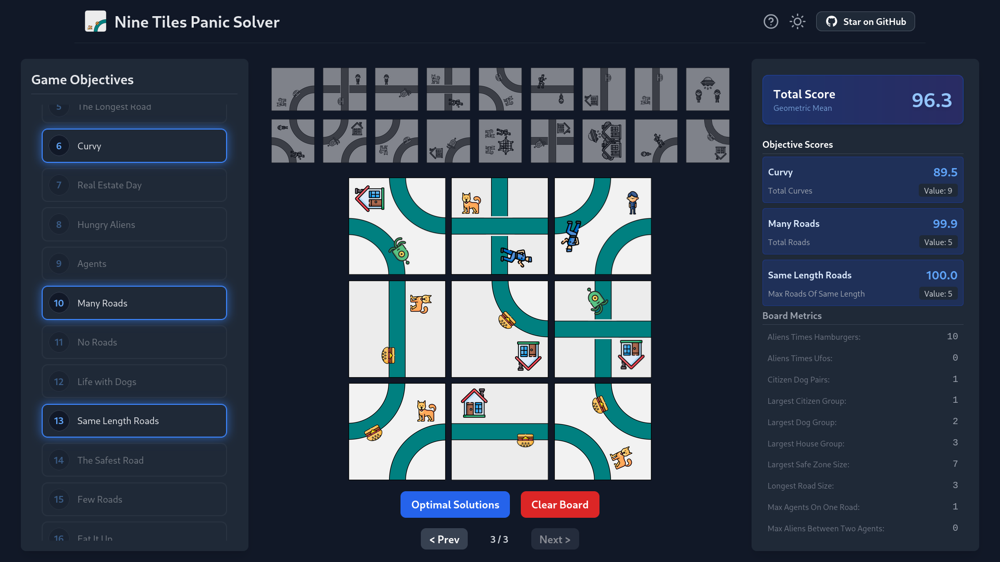

# Nine Tiles Panic Solver

[](https://www.python.org/downloads/)
[](https://duckdb.org/)
[](https://huggingface.co/datasets/rolim520/Nine-Tiles-Panic-Solutions)
[](https://brython.info/)
[](https://opensource.org/licenses/MIT)

A high-performance constraint satisfaction solver and data analytics pipeline for the real-time board game *Nine Tiles Panic*. Developed as a Computer Engineering undergraduate thesis at the Federal University of Rio de Janeiro (UFRJ).

To find the optimal city layout for any given game scenario, the solver must navigate a search space of **48.7 trillion** theoretical spatial arrangements ($9! \times 2^9 \times 4^9$). This project successfully maps the entire state space, identifying all **2,922,907,648** topologically valid boards, and utilizes Multiobjective Optimization to reduce the decision space to a strict Pareto-optimal set of **14,711** highly competitive configurations.

### Live Demo & Data
* **Interactive Web App**: [Nine Tiles Panic Solver Interface](https://rolim520.github.io/Nine-Tiles-Panic-Solver/)
* **Raw Dataset (4.27 GB)**: [Hugging Face Hub](https://huggingface.co/datasets/rolim520/Nine-Tiles-Panic-Solutions)



---

## System Architecture

The project is structured into two decoupled phases: the generation engine and the analytical pipeline.

### 1. Generation Engine (CSP & Search)
The physical rules of the game are modeled as a **Constraint Satisfaction Problem (CSP)**. The solver (`main.py` and `solver.py`) explores the state space using:
* **Parallelized Backtracking:** The search tree is partitioned by its root nodes and executed concurrently across multiple CPU cores.
* **Heuristic Pruning:** Uses Minimum Remaining Values (MRV) and Forward Checking to prune invalid branches early.
* **Union-Find:** A disjoint-set data structure is dynamically updated during the search to ensure acyclicity (preventing closed road loops) in $O(\alpha(n))$ time.

### 2. Analytics & Optimization Pipeline
The engine's output is serialized into highly compressed Apache Parquet files. The analytics pipeline (`scripts/analytics/`) processes this massive dataset out-of-core using **DuckDB**:
* **Percentile Normalization:** Standardizes 24 different board metrics into a uniform probability scale.
* **Pareto Frontier Extraction:** Filters out mathematically inferior boards across all 2,625 possible combinations of scoring objectives.
* **Monte Carlo Simulation:** Simulates 100,000 matches to validate scalarization strategies, proving that a **Weighted Product** heuristic provides the highest win rate against greedy and random opponents.

---

## Usage Options

There are two primary ways to interact with this repository: using the pre-compiled data via the web interface, or running the full generation and analytical pipeline from scratch.

### Option A: Local Web Interface (No processing required)
If you only want to explore the optimal boards, the repository already contains the finalized Pareto-optimal data (`docs/data/pareto_front.json`). You can run the interactive web app locally without installing complex dependencies or running the heavy backend solver.

1. Clone the repository:
```bash
git clone https://github.com/rolim520/Nine-Tiles-Panic-Solver.git
cd Nine-Tiles-Panic-Solver/docs
```
2. Start a local HTTP server:
```bash
python -m http.server 8000
```
3. Open your browser and navigate to `http://localhost:8000`.

### Option B: Full Generation and Analytics Pipeline
If you want to verify the methodology, re-generate the billions of solutions, and run the DuckDB analytical pipeline, follow these steps:

1. Clone the repository and install the backend requirements:
```bash
git clone https://github.com/rolim520/Nine-Tiles-Panic-Solver.git
cd Nine-Tiles-Panic-Solver
pip install -r requirements.txt
```

2. Run the CSP generation engine to find all valid boards:
```bash
python main.py
```
> **Warning:** Depending on your CPU, this process can take **from 12 to 24+ hours** to complete and will generate a ~4.27 GB Parquet file inside the `generated_solutions/` directory.

3. Execute the analytical pipeline sequentially to process the generated dataset:
```bash
python scripts/analytics/01_percentiles.py
python scripts/analytics/02_pareto.py
```

4. *(Optional)* Run the Monte Carlo simulation to evaluate scalarization strategies:
```bash
python scripts/analytics/03_montecarlo.py
```

---

## Repository Structure

```text
Nine-Tiles-Panic-Solver/
├── docs/                 # Static web interface files (HTML, JS, CSS, Brython)
├── game/                 # JSON definitions for game tiles, topologies, and cards
├── images/               # Visual assets and generated PDF/PNG plots
├── results/              # Aggregated analytical outputs (Gantt, Monte Carlo results)
├── scripts/              
│   ├── analytics/        # DuckDB data pipelines (Percentiles, Pareto, Monte Carlo)
│   └── plots/            # Matplotlib plotting scripts for thesis figures
├── main.py               # CSP generation engine entry point
├── solver.py             # Backtracking algorithm implementation
├── analysis.py           # Board statistics and graph analysis functions
└── constants.py          # Game topology and graph node mappings
```

---

## Acknowledgments

Special thanks to **Jean-Claude Pellin**, **Jens Merkl**, and **Oink Games** for designing and publishing *Nine Tiles Panic*. This project is purely an academic tribute to their excellent and challenging game design. All intellectual property regarding the game belongs to its respective creators and publishers.

UI and board icons were created by **[Freepik](https://www.freepik.com)** from **[Flaticon](https://www.flaticon.com/)**.
